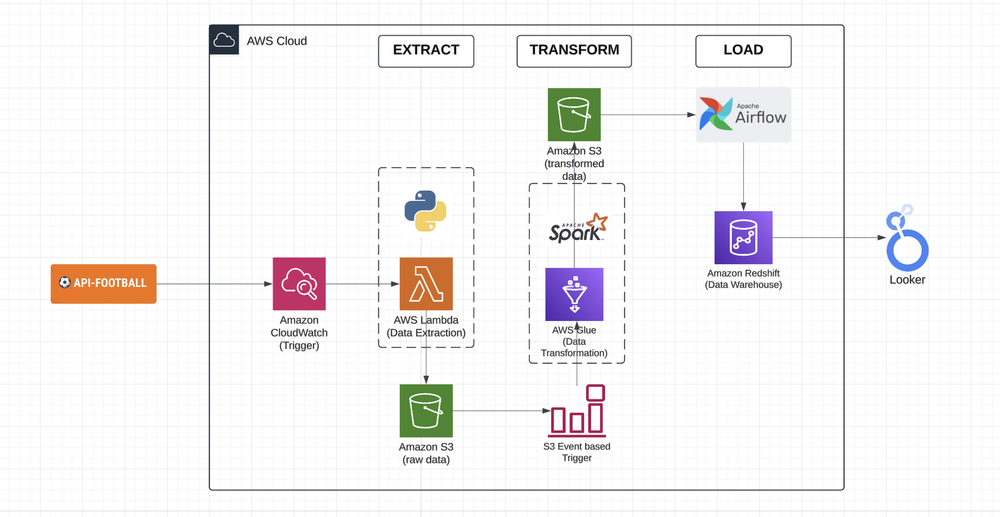
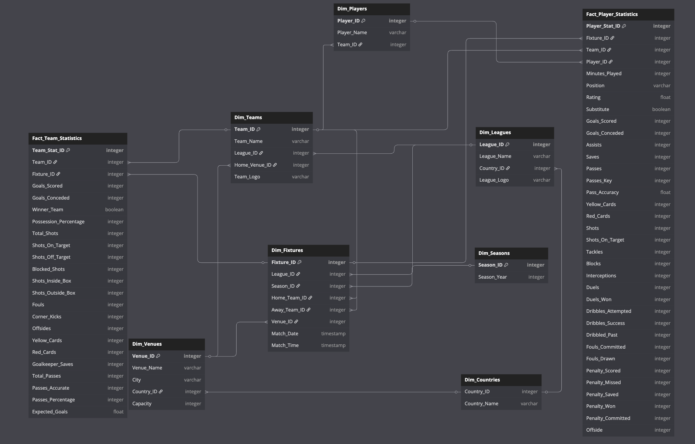
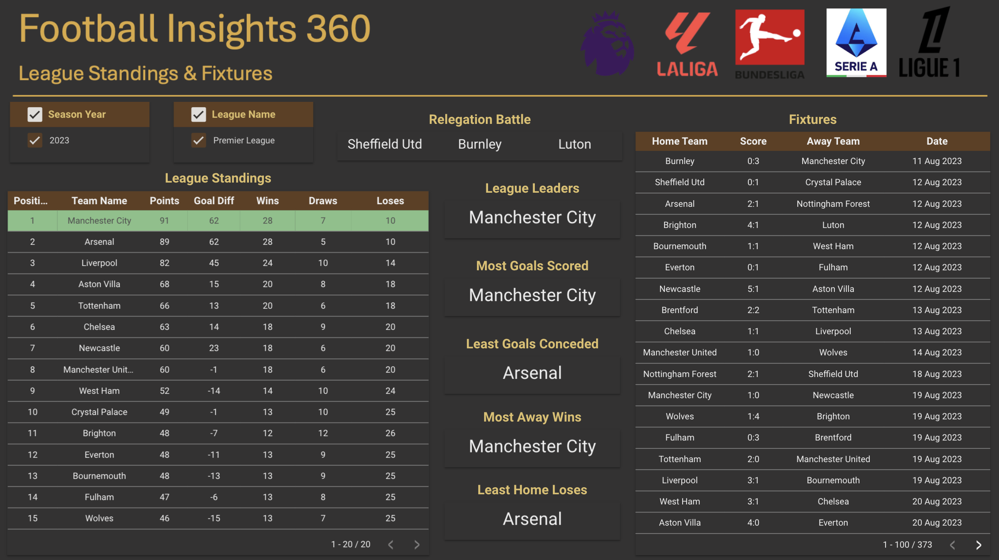
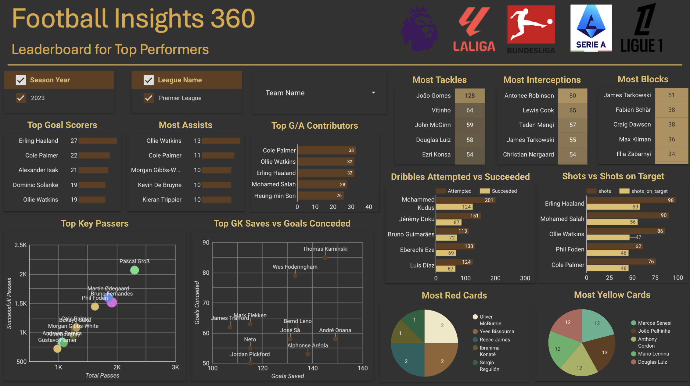

# Football Insights 360

## Overview
**Football Insights 360** is an end-to-end **ETL & Analytics** project that extracts, transforms, stores, and visualizes football data from the **API-SPORTS** service. The project leverages **AWS cloud services, Apache Airflow, and Looker Studio** to process data from the **top football leagues**, providing structured insights through an interactive dashboard.

## Links
Medium Article: https://medium.com/@gujje.anuraag/football-insights-360-586943ff5afa

Looker Dashboard: https://lookerstudio.google.com/reporting/26a7d6e6-2036-4c94-864b-f42894877764

## Project Architecture

The architecture follows a **serverless data pipeline** approach:

1. **Data Extraction:** AWS Lambda extracts football data from API-SPORTS and stores it in **S3 (raw_data folder)**.
2. **Data Modeling:** Designed a structured, denormalized schema for easy query performance and future scalability.
3. **Data Transformation:** AWS Glue processes raw data using PySpark and outputs structured data into **S3 (transformed_data folder)**.
4. **Data Load & Orchestration:** Apache Airflow automates the pipeline by transferring transformed data from **S3 to Redshift**.
5. **Data Warehouse & Analytics:** Amazon Redshift Serverless acts as a central data warehouse for structured data.
6. **Visualization:** Looker Studio directly connects to Redshift for real-time dashboard insights.

## Tech Stack
- **Cloud Services:** AWS Lambda, S3, Glue, Redshift Serverless
- **Orchestration:** Apache Airflow
- **Programming:** Python, PySpark
- **Data Warehouse:** Amazon Redshift (SQL queries & materialized views)
- **Visualization:** Looker Studio

## Data Modeling
The data model is designed to be **structured and denormalized** for efficient ACID operations and scalability. The schema follows a **star schema** approach with fact and dimension tables:

### **Fact Tables:**
1. **Fact_Player_Statistics**: Contains player-level performance data such as goals, assists, tackles, and passing accuracy etc. for each fixture.
2. **Fact_Team_Statistics**: Stores match-level team statistics such as possession, shots, and fouls etc..

### **Dimension Tables:**
1. **Dim_Fixtures**: Stores match fixture details such as teams, venue, and date.
2. **Dim_Leagues**: Information about leagues and their respective countries.
3. **Dim_Seasons**: Details of different seasons.
4. **Dim_Venues**: Information about match venues.
5. **Dim_Teams**: Stores team details and their home venues.
6. **Dim_Countries**: Country metadata for leagues and venues.
7. **Dim_Players**: Player metadata linked to teams.

## Workflow
### **1. Data Extraction (AWS Lambda & S3)**
- AWS Lambda executes a **Python script** to extract data from API-SPORTS.
- Extracted data is stored as JSON objects in **S3 (raw_data folder)**.
- **Trigger:** Scheduled every **10 minutes** to handle API rate limits.

### **2. Data Transformation (AWS Glue & PySpark)**
- A **Glue ETL job** reads raw data from **S3**, transforms it into a **structured & denormalized format**, and stores it in **S3 (transformed_data folder)**.
- **Trigger:** S3 event notification triggers Glue when new data arrives.

### **3. Data Storage (Amazon Redshift Serverless)**
- Created **Redshift tables** to store transformed data.
- Optimized schema for **Query Performance & future scalability**.

### **4. Data Load & Processing (Apache Airflow DAG)**
- Airflow DAG automates data movement from **S3 (transformed_data)** to **Redshift tables**.
- **Schedule:** Runs daily to refresh Redshift tables.
- SQL queries in Redshift generate insights on teams, players, and matches.

### **5. Visualization (Looker Studio & Redshift Materialized Views)**
- **Direct query connection** to Redshift for real-time insights.
- **Materialized views** optimize query performance.
- Looker Studio dashboard visualizes:
  - League standings
  - Team performance metrics
  - Match results & trends
  - Leaderboard for Top Performers

## Challenges & Solutions
| Challenge | Solution |
|-----------|----------|
| API rate limits prevented full extraction at once | Implemented Lambda with **scheduled trigger (10 min intervals)** to gradually fetch data |
| JSON data was semi-structured and nested | Used **PySpark (AWS Glue)** to flatten and transform data |
| Query performance issues due to large dataset | Created **Materialized Views** in Redshift for optimized queries |
| Direct Looker Studio connection had slow response times | Used **Redshift Serverless + Materialized Views** to speed up dashboard loading |

## Future Enhancements
- Develop a **fully integrated web application** to input live match data and enable **real-time analytics dashboards**.
- Implement a **dedicated SQL database** to store transformed data, ensuring better data integrity and faster ACID operations for incoming match data from the web app.
- Integrate **machine learning models** to predict match outcomes and player performance using historical and real-time data.

## Contributors
- **Anuraag Gujje**

